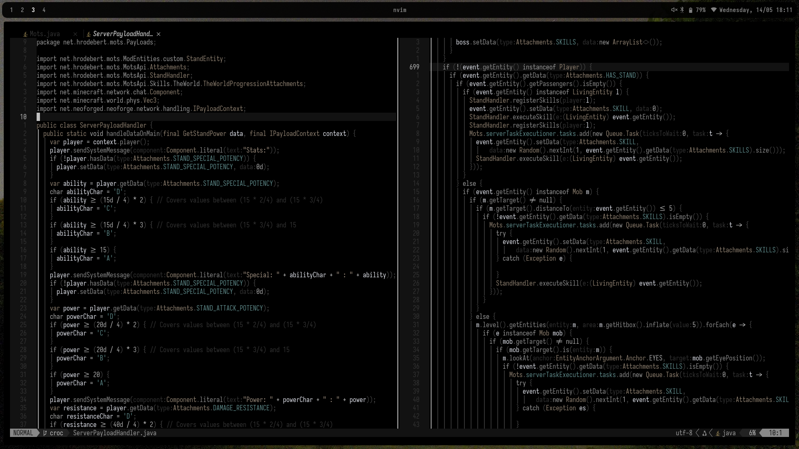
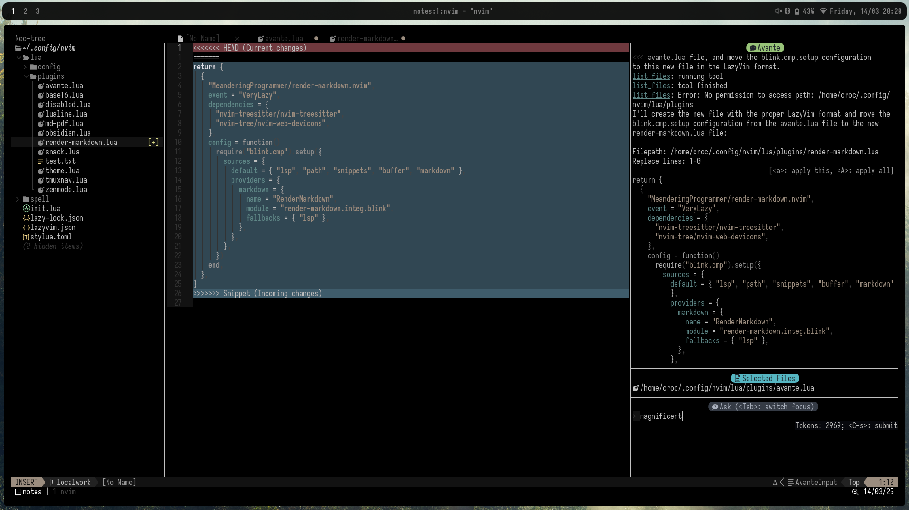
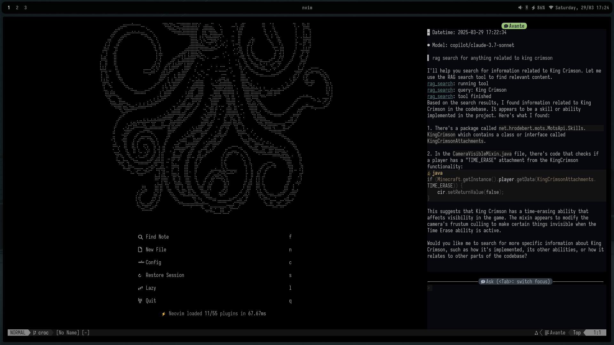
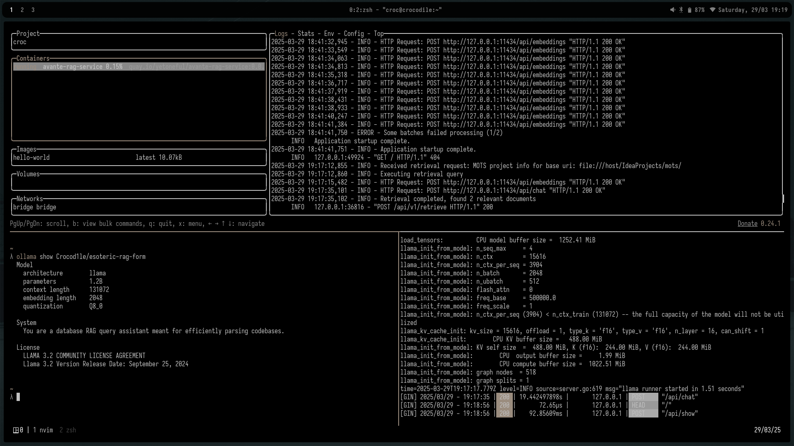

# Neovim Configuration

 

Personal Neovim configuration based on lazy.nvim.
This is meant to function as a note taker or a development environment.
An extremely maximalist but very optimised setup that does everything I _personally_ could need it to do. This is the result of me deciding that the damn app I use for writing has to be the best possible one and the only one. Everything inside this setup is endgame, as in, everything in this setup is the maximum possible most personalised thing I could possibly want for a given feature (especially the AI). The end result is that whatever I want to do can probably be done quickly, exactly how I want it, in extremely flashy fashion that reminds me of how much time I wasted doing all this. Much of this config required things that did not exist that day, so much of this config is on the agonisingly bleeding edge, and therefore, especially with some of the AI features that were literally born yesterday, ~~certain features can be a bit unstable~~ (now that some features are more than a week old I consider this stable). However, most of this config is collapsible and compartmentalised.

## Features

- Built on lazy.nvim for better plugin management
- Code completion and LSP support
- DAP and debugging UI
- File navigation and fzf with ripgrep
- Git functionality
  - Lualine git information display
  - Lazygit integration
- Markdown/Obsidian support
- Discord presence

---

## Model Integration

 

This took an embarrassing amount of time to make as good as I hoped it could be, but now it is. AI within this setup can be used for basically anything you can imagine, incredibly fast, within the editor, within 3 keyboard presses.

### Current Specs

- Base model: `gemini-2.5-flash-preview-17-04`
- Workhorse model: `gemini-2.5-pro-preview-05-06`
- Alt model: `o4-mini-preview`

### Current Features

- Custom version of avante.nvim code editing workflow
- Copilot support with model switching capabilities
- Support for multiple AI providers (OpenRouter, Ollama)
- Reworked for translating Gemini's function calls and allowing it to use tools
- Retrieval Augmented Generation Support
  - Running Ollama endpoint
  - My `crocod1le/rag-skeleton-build` based on Gemma-3 for language
  - My `crocod1le/snowflake-custom` running as embed
- Modular self generated MCP server integration
  - File/directory operation (view, grep, rename, delete, etc.)
  - Search codebase, dispatch search agents
  - Execute code (bash, python)
  - Web search/scrape, fetch, and puppet agents
  - Memory graphs
  - Sequential thinking and behaviour mods
  - Git and Github operations
  - Context management and definition retrieval

## So what does this look like in practice (basic workflow)?

1. Custom configuration tool information and system prompt loaded on start
2. 3 keys to open window
3. File is automatically added to context
4. Prompt
5. Information from user and information about current tools and files is given to model
6. Model parses prompt then thinks about what tools may be needed
   - If tools are needed, runs tools and checks to make sure they have been used successfully, updating itself
7. After all necessary tools have been used, the response is formatted into a applicable snippet
8. A separate model applies the edits to your files
