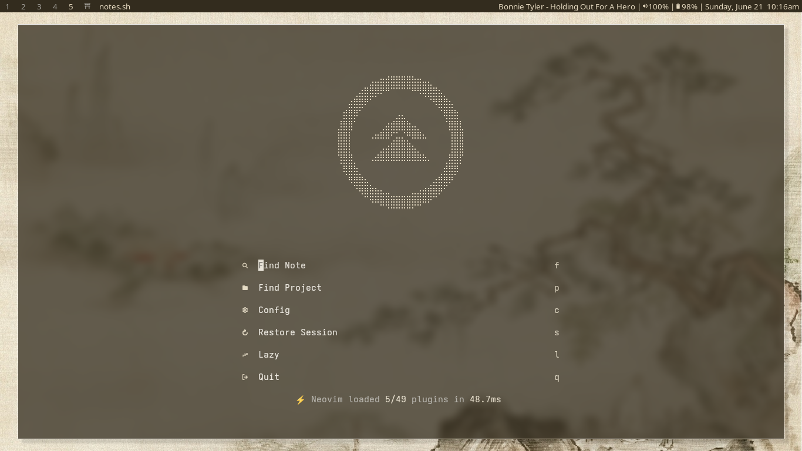
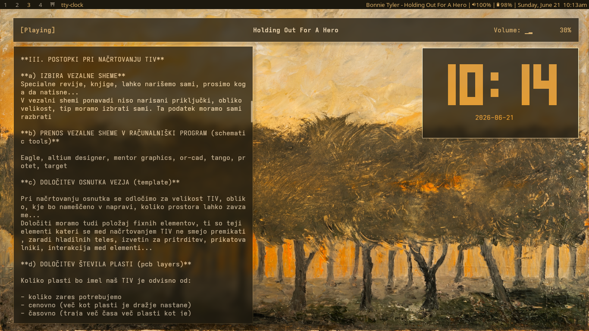

## dwm - dynamic window manager - atego's build

 

## Basic Keybinds

All keybinds use `Mod` (Windows key) unless otherwise specified.

| Keybind | Action |
| -------------------------- | --------------------------------------- |
| `Mod + Enter` | Open terminal (kitty) |
| `Mod + Shift + Enter` | Open secondary terminal (st) |
| `Mod + P` | Launch dmenu |
| `Mod + Q` | Kill focused window |
| `Mod + Shift + Q` | Kill unfocused windows |
| `Mod + BackSpace` | Lock screen |
| `Mod + Shift + Backspace` | Exit dwm |
| `Mod + Right Shift` | Power menu (boot menu) |
| `Mod + Ctrl + Shift + Q` | Refresh dwm (recompile and restart) |

### Navigation & Focus

| Keybind | Action |
| ------------------------ | ----------------------------------------------------- |
| `Mod + J` | Focus next window in stack |
| `Mod + K` | Focus previous window in stack |
| `Mod + Shift + J` | Move focused window down in stack |
| `Mod + Shift + K` | Move focused window up in stack |
| `Mod + Tab` | Switch between last 2 visited tags |
| `Mod + 1-9` | Switch to tag N |
| `Mod + Ctrl + 1-9` | Toggle view of tag N |
| `Mod + Shift + 1-9` | Move focused window to tag N |
| `Mod + Ctrl + Shift + 1-9` | Toggle focused window on tag N |
| `Mod + 0` | View all tags |
| `Mod + Shift + 0` | Move focused window to all tags |

### Layout & Window Management

| Keybind                    | Action                                                        |
| ---------------------------- | ------------------------------------------------------------------ |
| `Mod + F`                   | Toggle fullscreen                                                |
| `Mod + Shift + Space`       | Toggle floating                                                  |
| `Mod + Space`                | Zoom (promote to master)                                        |
| `Mod + Ctrl + Space`         | Focus master                                                    |
| `Mod + H / L`                | Decrease/increase master area size                              |
| `Mod + Shift + I`            | Increase number of master windows                               |
| `Mod + Ctrl + I`             | Decrease number of master windows                               |
| `Mod + Ctrl + Shift + L`     | Toggle sticky window                                            |

> Layout-switching keybinds (Tiled/Monocle/Spiral/Dwindle, previously on `Mod+K` and friends) and the default-layout bind on `Mod+Ctrl+Space` are currently commented out in `config.h` — there's no active keybind to change layout right now.

### Gaps Control

| Keybind           | Action           |
| ------------------- | ------------------ |
| `Mod + G`           | Decrease gaps       |
| `Mod + Shift + G`   | Increase gaps       |

### Multi-Monitor

| Keybind           | Action                          |
| ------------------- | ---------------------------------- |
| `Mod + [`           | Focus next monitor               |
| `Mod + ]`           | Focus previous monitor           |
| `Mod + Shift + [`   | Move window to next monitor      |
| `Mod + Shift + ]`   | Move window to previous monitor  |

### Applications

| Keybind                    | Action                                    |
| ----------------------------- | -------------------------------------------- |
| `Mod + M`                    | Open music player (rmpc, in kitty)         |
| `Mod + A`                    | Open anime player (anipy-cli, in kitty)    |
| `Mod + B`                    | Open browser                               |
| `Mod + D`                    | Open Discord (Vesktop)                     |
| `Mod + Shift + D`            | Open music data editor (yt-music-tool)     |
| `Mod + Shift + B`            | Open system monitor (btop, in kitty)       |
| `Mod + C`                    | Open calendar checker                      |
| `Mod + N`                    | Open ZenNotes                              |
| `Mod + Shift + N`            | Open neovim (in kitty)                     |
| `Mod + Shift + F`            | Open file manager (nautilus)               |
| `Mod + Ctrl + Shift + B`     | Open book reader (Foliate)                 |
| `Mod + Y`                    | Open YouTube player                        |
| `Mod + Z`                    | Open Zed editor                            |
| `Mod + Shift + M`            | Open PrismLauncher                         |
| `Mod + Ctrl + Shift + W`     | Open MS Office (OnlyOffice)                |
| `Mod + Ctrl + Shift + S`     | Open Steam                                 |
| `Mod + Shift + W`            | Open wallpaper picker (gif-test)           |
| `Mod + Ctrl + J`             | Camera preview                             |
| `Mod + T`                    | Toggle kitty transparency                  |
| `Mod + Shift + T`            | Toggle trackpad                            |

### Audio & Recording

| Keybind             | Action                    |
| ---------------------- | ---------------------------- |
| `Mod + O`             | Switch audio output         |
| `Mod + I`             | Switch audio input          |
| `Mod + Ctrl + A`      | Toggle audio recording      |
| `Mod + Shift + R`     | Toggle screen recording     |

### Screenshots

| Keybind           | Action                        |
| ------------------- | --------------------------------- |
| `Mod + Shift + S`   | Screenshot                       |
| `Mod + Ctrl + S`    | Screenshot (specific/select)     |
| `Mod + F2`          | Screenshot (backup bind)         |

### Statusbar

| Keybind           | Action                        |
| ------------------- | --------------------------------- |
| `Mod + Ctrl + B`    | Toggle bar visibility            |
| `Mod + Ctrl + T`    | Toggle dwmblocks status text     |
| `Mod + Ctrl + X`    | Refresh colors (xrdb)            |

### Media & Function Keys

| Key                         | Action                    |
| ------------------------------ | ---------------------------- |
| `Volume Mute`                 | Toggle mute                 |
| `Volume Down/Up`              | Lower/raise volume by 5%    |
| `Mic Mute`                    | Toggle mic mute             |
| `Brightness Down/Up`          | Adjust screen brightness    |
| `Tools`                       | Open music player (rmpc)    |
| `Media Stop/Prev/Play/Next`   | Control mpd playback        |
| `Mail`                        | Open Gmail                  |
| `Mod + F9`                    | Open Gmail                  |
